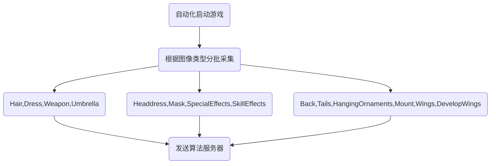

```mermaid
graph TB
    A(自动化启动游戏) --> b(根据图像类型分批采集)
    b(根据图像类型分批采集) -->c(Hair,Dress,Weapon,Umbrella)
    b(根据图像类型分批采集) -->d(Headdress,Mask,SpecialEffects,SkillEffects)
    b(根据图像类型分批采集) -->e(Back,Tails,HangingOrnaments,Mount,Wings,DevelopWings)
    c(Hair,Dress,Weapon,Umbrella) --> f(发送算法服务器)
    d(Headdress,Mask,SpecialEffects,SkillEffects)--> f(发送算法服务器)
    e(Back,Tails,HangingOrnaments,Mount,Wings,DevelopWings) --> f(发送算法服务器)
```
