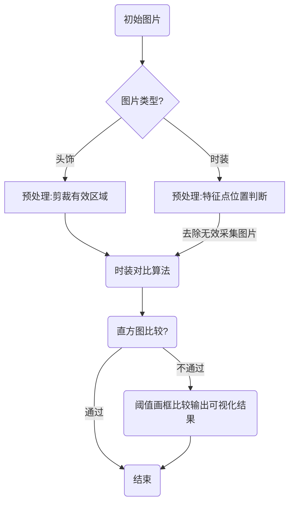

```mermaid
graph TB
    A(初始图片) --> C{图片类型?}
    C{图片类型?} -- 头饰 --> d[预处理:剪裁有效区域]
    C{图片类型?} -- 时装 --> e[预处理:特征点位置判断]
    d[预处理:剪裁有效区域] --> i(时装对比算法)
    i(时装对比算法) --> f(直方图比较?)
    e[预处理:特征点位置判断] -- 去除无效采集图片 --> i(时装对比算法)
    f(直方图比较?) -- 通过 --> g(结束)
    f(直方图比较?) -- 不通过 --> h(阈值画框-输出可视化结果)
    h(阈值画框比较输出可视化结果) --> g(结束)
    i(时装对比算法)
```
